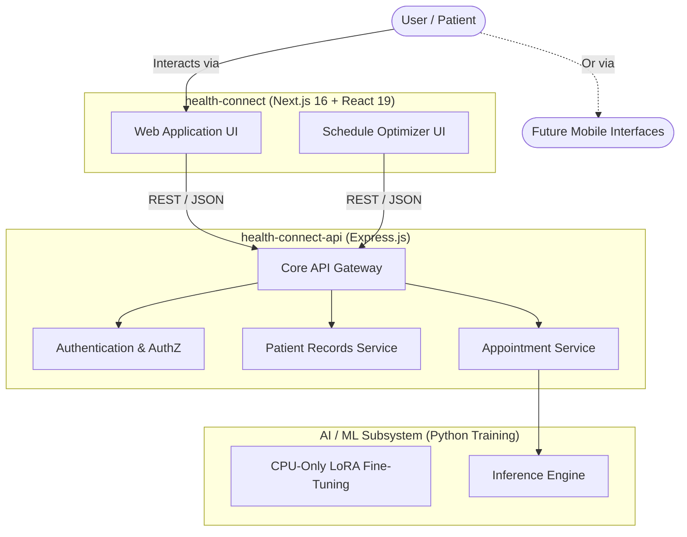
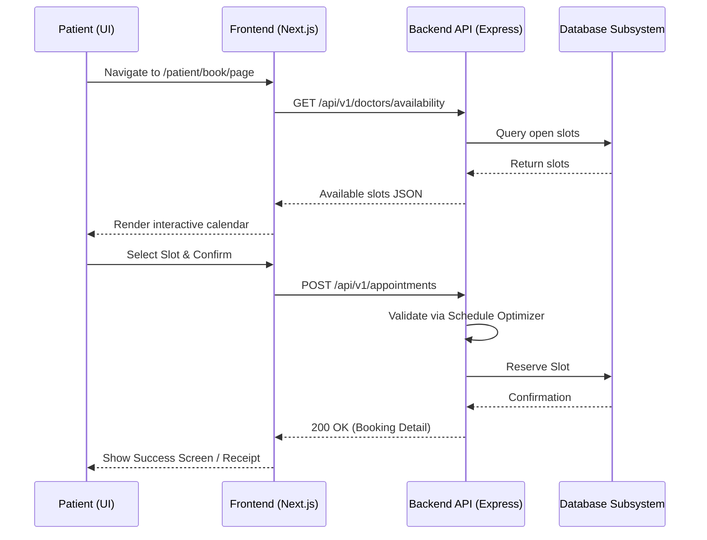
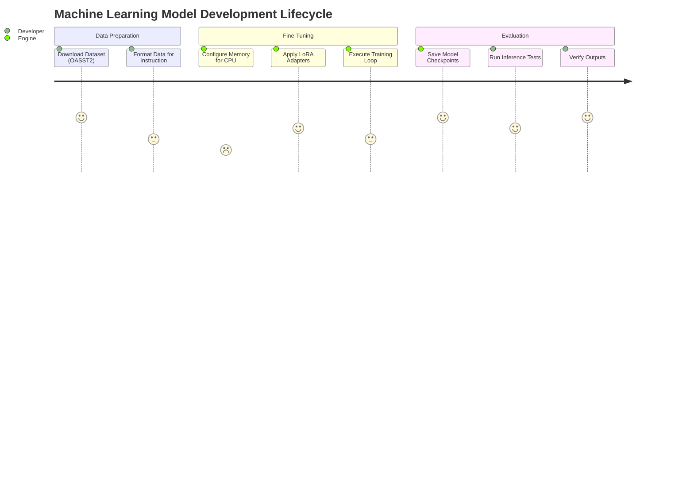
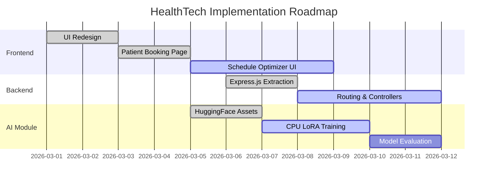

# HealthTech Application

A comprehensive, private healthcare technology project designed to bridge modern front-end experiences with secure, reliable, and intelligent backend services.

## Architecture Overview

The HealthTech ecosystem is built as a modernized, decoupled architecture consisting of a Next.js frontend, an Express.js backend, and integrated Artificial Intelligence/Machine Learning capabilities.

### high-Level Architecture

The below diagram illustrates the overarching architecture of the HealthTech system.

## System Components

### 1. The Frontend (`health-connect`)
A modern interface utilizing Next.js and React.
- **Dynamic Routing**: Implements user flows like patient booking (`app/patient/book/page.tsx`).
- **Interactive UI**: Utilizing inline SVGs over emojis, polished micro-animations, and dynamic component rendering to offer a human-crafted touch.
- **Schedule Optimizer**: A specialized dashboard that helps configure and verify medical schedules dynamically.

### 2. The Backend API (`health-connect-api`)
A standalone Express.js server providing business logic routing, separated from the Next.js presentation layer to enforce strong separation of concerns.
- **TypeScript-Driven**: Ensures end-to-end type safety.
- **Stateless REST Architecture**: Enabling horizontal scalability for appointment booking and data retrieval.

### 3. AI Fine-Tuning Module
The project encompasses an isolated AI workflow targeted at fine-tuning Hugging Face language models (utilizing the OASST2 dataset). It incorporates:
- Specialized CPU-Only fine-tuning logic to account for hardware limitations.
- Low-Rank Adaptation (LoRA) for memory-efficient training runs.
- Advanced scripting for downloading datasets and subsequently evaluating inference performance.

## Core Workflows

### Patient Booking Flow

The booking mechanism is at the heart of the application, incorporating real-time availability sync and Schedule Optimizer verifications.

### AI Model Fine-Tuning Lifecycle

## Project Timeline Tracking

The overall integration roadmap illustrating frontend, API, and AI module timelines.

## Project Status & Contribution Guidelines

**This repository is strictly private and proprietary.** 

The HealthTech project is built internally and is **not open for collaboration**.
- **No contributions** are accepted.
- Pull requests and feature requests submitted by external developers will be unequivocally discarded.
- This project is entirely closed-source, intended solely for internal consumption and production deployment. No aspect of this code relates to open-source contributions. 
